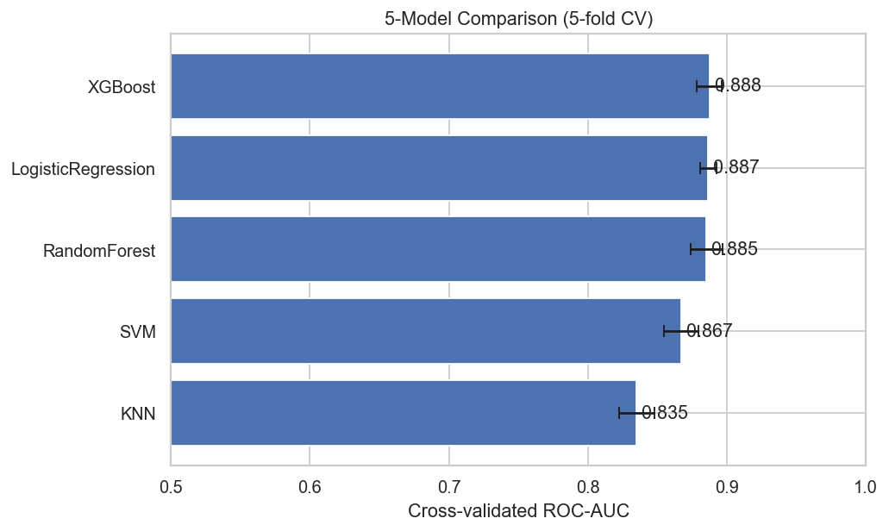
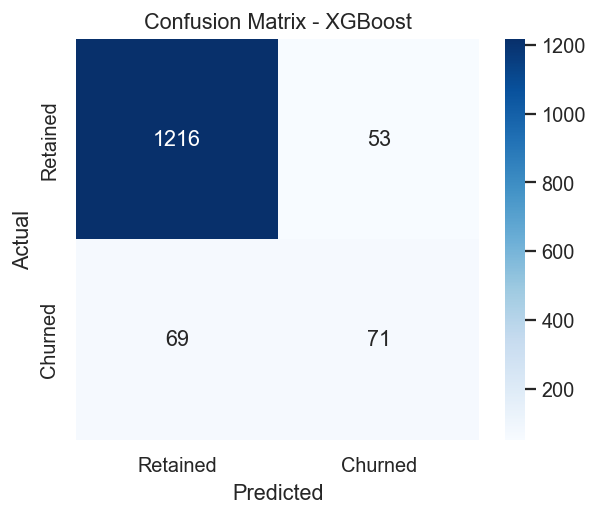
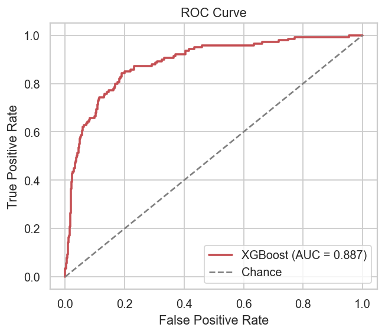
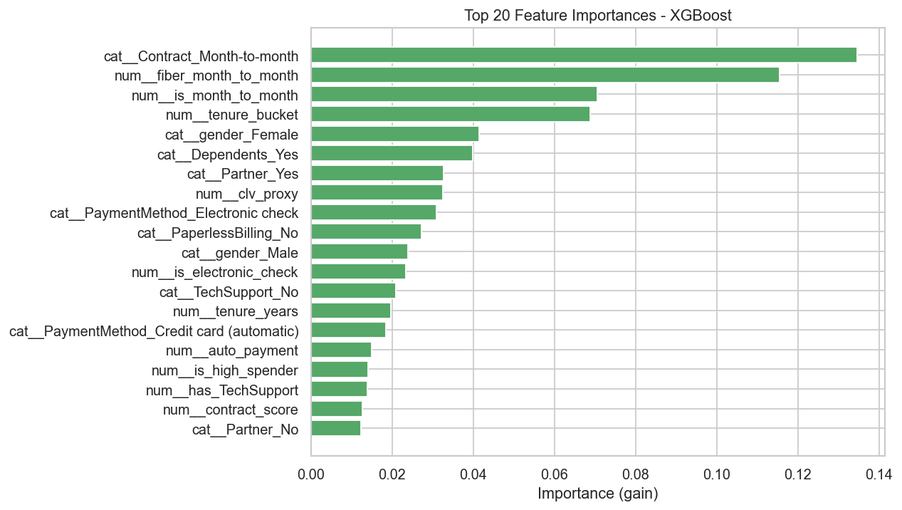

# Customer Churn Prediction

[](https://github.com/agvs03/customer-churn-prediction/actions/workflows/ci.yml)
[](https://github.com/agvs03/customer-churn-prediction/actions/workflows/codeql.yml)
[](https://github.com/agvs03/customer-churn-prediction/actions/workflows/docker-image.yml)

An end-to-end machine-learning project that predicts whether a telecom customer will churn. It covers the full lifecycle: exploratory analysis, data cleaning, feature engineering, class-imbalance handling with SMOTE, comparison of five models with cross-validation, hyperparameter tuning, experiment tracking with MLflow, and a Dockerized FastAPI service for real-time inference.

The tuned **XGBoost** model reaches **~91% accuracy** and **~0.88 ROC-AUC** on a held-out test set.

---

## Results at a glance

| Metric (hold-out test set) | XGBoost (tuned) |
|---|---|
| Accuracy | **0.913** |
| ROC-AUC | **0.888** |
| Precision | 0.573 |
| Recall | 0.507 |
| F1 | 0.538 |
| Best CV ROC-AUC | 0.891 |

**Model comparison (5-fold stratified cross-validation, ROC-AUC):**

| Model | CV ROC-AUC |
|---|---|
| **XGBoost** | **0.888** |
| Logistic Regression | 0.887 |
| Random Forest | 0.885 |
| SVM (RBF) | 0.867 |
| KNN | 0.835 |

XGBoost wins because it captures non-linear interaction effects (e.g. *fiber-optic × month-to-month contract*, and the tenure × spend interaction) that the linear models cannot.

<p align="center">
  
</p>

| Confusion matrix | ROC curve | Feature importance |
|---|---|---|
|  |  |  |

The strongest churn drivers are **month-to-month contracts, fiber-optic internet, short tenure, electronic-check payment, and the absence of tech-support / online-security add-ons**.

---

## Project structure

```
customer-churn-prediction/
├── api/                      # FastAPI serving layer
│   ├── main.py               # /health and /predict endpoints
│   └── schemas.py            # Pydantic request/response models
├── data/
│   ├── generate_data.py      # Synthetic Telco-style dataset generator
│   └── sample_head.csv       # Small committed data sample
├── models/                   # Saved pipeline + metrics.json (git-ignored)
├── notebooks/
│   └── churn_analysis.ipynb  # Full EDA + modeling walkthrough
├── reports/figures/          # Generated visualizations
├── src/
│   ├── config.py             # Loads config.yaml
│   ├── data_loader.py        # Real Telco CSV -> synthetic fallback
│   ├── preprocessing.py      # Cleaning
│   ├── feature_engineering.py# 25+ engineered features
│   ├── evaluate.py           # Plotting + metric helpers
│   └── train.py              # Full training pipeline
├── tests/
│   └── test_api.py           # API smoke tests
├── config.yaml               # Central configuration
├── requirements.txt
├── Dockerfile
├── docker-compose.yml
└── Makefile
```

---

## Dataset

The pipeline works with the **IBM/Kaggle Telco Customer Churn** dataset. Drop
`WA_Fn-UseC_-Telco-Customer-Churn.csv` into `data/` and it is used automatically.

If that file is not present, a **synthetic Telco-style generator**
(`data/generate_data.py`) produces a statistically realistic dataset (same schema,
churn driven by a latent risk model with irreducible noise so the problem is
non-trivial), so the entire project runs out-of-the-box with **no downloads**.

```bash
python data/generate_data.py --rows 7043 --out data/churn_raw.csv
```

---

## Setup

```bash
# 1. Clone
git clone https://github.com/<your-username>/customer-churn-prediction.git
cd customer-churn-prediction

# 2. Create an environment and install dependencies
python -m venv .venv && source .venv/bin/activate   # Windows: .venv\Scripts\activate
pip install -r requirements.txt
```

---

## Usage

### Train the model

```bash
python -m src.train          # or:  make train
```

This runs the full pipeline: load → clean → engineer features → SMOTE → compare
5 models with 5-fold CV → `GridSearchCV`-tune XGBoost → evaluate → log to MLflow →
save `models/churn_xgb_pipeline.joblib`, `models/metrics.json`, and all figures in
`reports/figures/`.

### Explore in Jupyter

```bash
jupyter notebook notebooks/churn_analysis.ipynb
```

### Track experiments with MLflow

```bash
mlflow ui --backend-store-uri sqlite:///mlflow.db --port 5000   # or: make mlflow-ui
# open http://localhost:5000
```

Every model's parameters and metrics are logged to the `customer-churn-prediction`
experiment.

### Serve predictions (FastAPI)

```bash
uvicorn api.main:app --reload --port 8000    # or: make api
# open http://localhost:8000/docs  for interactive Swagger UI
```

Example request:

```bash
curl -X POST http://localhost:8000/predict \
  -H "Content-Type: application/json" \
  -d '{
        "gender": "Female", "SeniorCitizen": 1, "Partner": "No", "Dependents": "No",
        "tenure": 2, "PhoneService": "Yes", "MultipleLines": "No",
        "InternetService": "Fiber optic", "OnlineSecurity": "No", "OnlineBackup": "No",
        "DeviceProtection": "No", "TechSupport": "No", "StreamingTV": "Yes",
        "StreamingMovies": "Yes", "Contract": "Month-to-month", "PaperlessBilling": "Yes",
        "PaymentMethod": "Electronic check", "MonthlyCharges": 95.7, "TotalCharges": 191.4
      }'
```

Response:

```json
{
  "churn": true,
  "churn_probability": 0.63,
  "risk_band": "Medium",
  "model_version": "1.0.0"
}
```

### Run with Docker

```bash
docker compose up --build            # or: make docker
# API on http://localhost:8000 ; add `--profile tracking` for the MLflow UI on :5000
```

### Run tests

```bash
pytest -q                            # or: make test
```

---

## Methodology

**Cleaning.** Coerce the blank `TotalCharges` values (new customers) to 0, drop the
`customerID` identifier, remove duplicates, and encode the target to 0/1.

**Feature engineering (25+ features).** Add-on service counts, streaming/support
service counts, tenure buckets and year conversions, new-customer and loyalty flags,
spend-velocity and billing-consistency ratios, an average-revenue-per-service metric,
contract-commitment and payment-method flags, a customer-lifetime-value proxy, and
interaction features such as `fiber_month_to_month` and `no_support_high_charge`. The
identical, stateless transform is reused at serving time so training and inference
never diverge.

**Class imbalance.** Churners are the minority class. **SMOTE** is applied *inside*
the cross-validation pipeline (never on the validation fold), which prevents the
optimistic-bias leakage you get from resampling before splitting.

**Modeling.** Five classifiers — Logistic Regression, Random Forest, XGBoost, SVM,
and KNN — are each wrapped in a `preprocess → SMOTE → classifier` pipeline and scored
by 5-fold stratified ROC-AUC. XGBoost is then tuned with `GridSearchCV` over tree depth,
learning rate, and the number of estimators.

**Tracking & serving.** MLflow records every run's parameters and metrics. The tuned
pipeline is persisted with `joblib` and served through a FastAPI `/predict` endpoint,
containerized with Docker.

---

## Configuration

All paths and hyperparameters live in `config.yaml` (seed, CV folds, scoring metric,
SMOTE toggle, MLflow experiment name, artifact locations). The MLflow tracking URI can
be overridden with the `MLFLOW_TRACKING_URI` environment variable.

---

## Notes

The headline metrics were produced with the bundled synthetic dataset (seed = 42).
Swapping in the real Kaggle Telco CSV will shift the exact numbers but the full
pipeline runs unchanged. Because the classes are imbalanced, ROC-AUC and recall are
better indicators of model quality than raw accuracy — the project reports all of them.

## License

MIT
